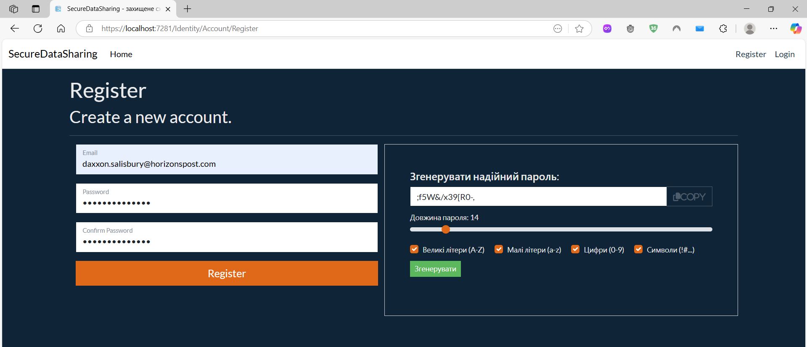
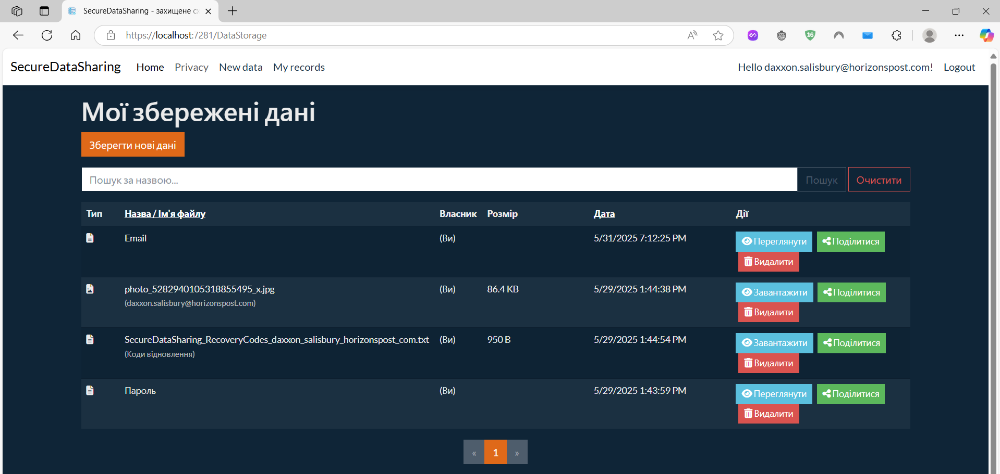
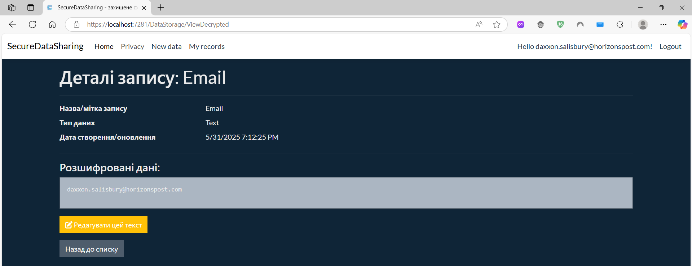
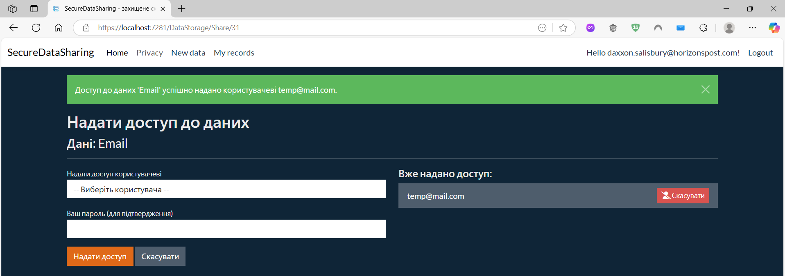
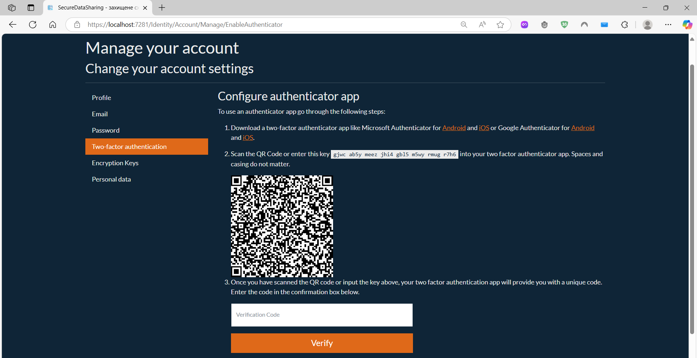
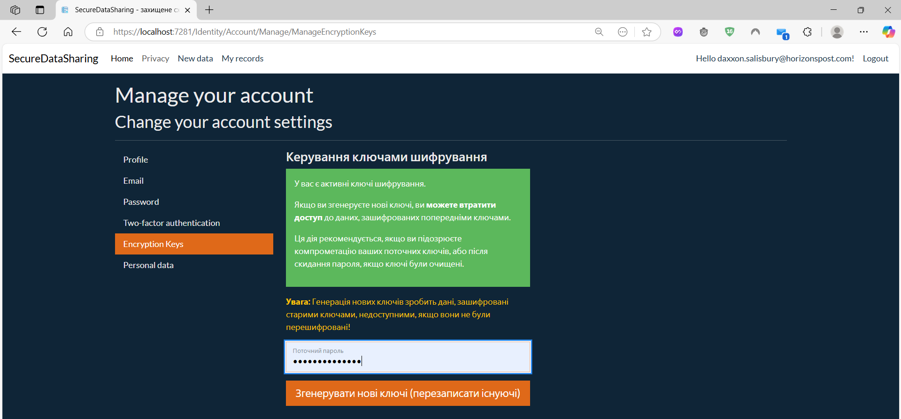

# SecureDataSharing

Веб-застосунок, розроблений для забезпечення безпечного зберігання, шифрування та контрольованого обміну текстовою інформацією та файлами між довіреними користувачами з використанням індивідуальних криптографічних ключів.


# 📘 Система захищеного зберігання і обміну інформацією між довіреними користувачами

> Веб-застосунок, для шифрування збереженої інформації і обміну інформацією між довіреними користувачами.

---

## 👤 Автор

- **ПІБ**: Гофнер Олександр
- **Група**: ФЕІ-43
- **Керівник**: Франів Володимир, доцент
- **Дата виконання**: [05.06.2025]

---

## 📌 Загальна інформація

- **Тип проєкту**: Веб-застосунок
- **Мова програмування**: C#
- **Фреймворки / Бібліотеки**: ASP.NET Core MVC + Razor Pages, Entity Framework Core, SQL Server 2022, ASP.NET Core Identity, AspNetCore.Cryptography, System.Security.Cryptography, Bootstrap5, HTML, CSS, JavaScript, jQuery, SendGrid. 

---

## 🧠 Опис функціоналу
1. 🔐 Безпечна реєстрація та автентифікація:
  - Реєстрація з автоматичною генерацією індивідуальної RSA-пари ключів для кожного користувача.
  - Захист приватного RSA-ключа паролем користувача (PBKDF2 + AES).
  - Вхід в систему з перевіркою пароля.
  - Підтримка двофакторної автентифікації (2FA) через додатки-автентифікатори Microsoft Authenticator, Google Authenticator з QR-кодами та кодами відновлення.
2. 🔑 Керування обліковим записом та власними ключами:
  - Безпечна зміна пароля з перешифруванням приватного RSA-ключа.
  - Відновлення забутого пароля через email (з очищенням старих криптографічних ключів).
  - Можливість для користувача згенерувати нову пару RSA-ключів після скидання пароля.
  - Повне видалення акаунту користувача з очищенням усіх пов'язаних даних та дозволів.
3. 💾 Захищене зберігання даних (текстів та файлів):
  - Створення текстових записів та завантаження файлів.
  - Конвертне шифрування: вміст шифрується унікальним симетричним Ключем Шифрування Даних (DEK - AES), а сам DEK шифрується асиметрично публічним RSA-ключем власника.
  - Зберігання зашифрованого вмісту (EncryptedContentBytes) та криптографічних даних (InitializationVector, EncryptedDekForOwner) в базі даних SQL Server 2022.
  - Обмеження на розмір файлів, що завантажуються до 2 ГБ.
4. 👁️ Доступ та розшифрування даних:
  - Власники можуть переглядати або завантажувати свої розшифровані дані після підтвердження паролем.
5. 🤝 Безпечний обмін даними:
  - Власник може надавати доступ до своїх даних іншим зареєстрованим користувачам.
  - DEK шифрується публічним RSA-ключем отримувача та зберігається у таблиці (DataPermissions).
  - Отримувач може переглядати та завантажувати дані, після підтвердження своїм паролем.
  - Можливість скасування наданого доступу власником.
6. ✏️ Редагування та Видалення Даних:
  - Редагування назви та вміст тексту власником.
  - Повторне використання DEK при редагуванні вмісту.
  - Видалення даних власником (з видаленням всіх наданих дозволів).
7. 📜 Аудит Дій:
  - Логування ключових дій користувачів та подій безпеки в базу даних.
8. 🎨 Інтерфейс Користувача:
  - Опис застосунку для користувача на головній сторінці.
  - Пошук, сортування, пагінація для списків даних.
  - Динамічні елементи: генератор паролів на сторінці реєстрації та відновлення паролю.
  - Опис записів: власник запису, розмір файлів, дата створення запису.
---

## 🧱 Опис основних класів / файлів

| Клас / Файл     | Призначення |
|----------------|-------------|
| `ApplicationUser.cs (Models/)`      | Зберігає криптографічні ключі користувача |
| `StoredData.cs (Models/)`    | Збереження тексту/файлів, включаючи зашифрований вміст |
| `DataPermission.cs (Models/)` | Зберігання дозволів на обмін даними |
| `AuditLog.cs (Models/)` | Записи аудиту |
| `CryptographyService.cs (Services/)` | Інкапсулює всю криптографічну логіку (генерація ключів, шифрування, розшифрування, PBKDF2, PEM). |
| `AuditService.cs (Services/)` | Записує події аудиту |
| `EmailSender.cs (Services/)` | IEmailSender<ApplicationUser> для надсилання email |
| `DataStorageController.cs (Controllers/)` | Основний контролер для керування даними |
| `Register.cshtml.cs` | Реєстрація користувача, включаючи генерацію RSA-ключів. |
| `ChangePassword.cshtml.cs` | Зміна пароля з перешифруванням приватного ключа. |
| `ResetPassword.cshtml.cs` | Скидання пароля з очищенням ключів. |
| `ManageEncryptionKeys.cshtml.cs` | Генерація нових ключів користувачем. |
| `PersonalData.cshtml.cs` | Сторінка персональних даних |

---

## ▶️ Як запустити проєкт "з нуля"

### 1. Встановлення Необхідного Програмного Забезпечення

- .NET 8 SDK: (Посилання на офіційний сайт)
- Visual Studio 2022 Community Edition разом з Workloads `ASP.NET and web development`.
- SQL Server 2022 Express Edition. Під час встановлення встановіть ім'я - екземпляра `SQLEXPRESS01`.
- SQL Server Management Studio (SSMS).

### 2. Клонування репозиторію

```bash
git clone https://github.com/oleksandrhofner/SecureDataSharing
cd SecureDataSharing
```

### 3. Налаштування Бази Даних SQL Server 2022

  1. Переконайтеся, що ваш екземпляр SQL Server запущено.
  2. Запустіть SSMS та підключіться до вашого екземпляра (<pc_name>\SQLEXPRESS01).
  3. У SSMS створіть нову порожню базу даних з назвою `SecureDataSharingDB`.

### 4. Конфігурація Проєкту

  1. Відкрийте файл рішення `SecureDataSharing.sln` у Visual Studio.
  2. Рядок підключення: Відкрийте `appsettings.json`. Оновіть DefaultConnection у секції `ConnectionStrings`, щоб він вказував на ваш SQL Server та базу `SecureDataSharingDB`:
  ```
  "DefaultConnection": "Server=<pc_name>\\SQLEXPRESS01;Database=SecureDataSharingDB;Trusted_Connection=True;MultipleActiveResultSets=true;Encrypt=false"
  ```

3. User Secrets (для API ключів): Якщо використовується реальний EmailSender (наприклад, SendGrid), налаштуйте API ключ через "Manage User Secrets":
```
{
  "SendGridKey": "SENDGRID_API_KEY"
}
```

### 5. Створення Схеми Бази Даних (Міграції EF Core)

  1. У Visual Studio відкрийте Package Manager Console.
  2. Переконайтеся, що вибрано проєкт SecureDataSharing.
  3. Виконайте команду:
  ```
  Update-Database
  ```
---

### 6. Збірка та Запуск Застосунку

  1. У Visual Studio: `Build` -> `Rebuild Solution`.
  2. Запустіть застосунок (`F5` або кнопка "Play").
  3. При першому запуску може знадобитися підтвердження, щоб довіряти SSL-сертифікатам розробки.
  4. Можна перевіряти весь доступний функціонал системи.

## 🖱️ Інструкція для користувача

1. **Реєстрація та Вхід:**
  - На головній сторінці натисніть "Register", використайте генератор паролів.
  - Після реєстрації увійдіть, використовуючи свій email та пароль.
  - Налаштуйте 2FA у профілі для підвищення безпеки.

2. **Створення Запису:**
  - Перейдіть у меню `New data`.
  - Виберіть тип (Text/File), введіть назву, вміст або завантажте файл.
  - Введіть пароль для збереження і шифрування.
3. **Перегляд або Завантаження:**
  - У меню `My records` натисніть кнопку `Переглянути` (для тексту) або `Завантажити` (для файлу).
  - Введіть пароль для розшифрування.
4.  **Обмін Даними:**
  - У списку ваших записів натисніть "Поділитися".
  - Виберіть користувача, введіть свій пароль для підтвердження.
5. **Керування Акаунтом:**
  - У профілі можна змінити пароль (старі дані залишаться доступними).
  - Скинути забутий пароль (доступ до старих даних втратиться, потрібно генерувати нові ключі).
  - Видалити акаунт (всі дані та дозволи будуть видалені).
---

## 📷 Приклади / скриншоти

  - Сторінка реєстрації з генератором паролів.
    
  - Сторінка створення запису.
    
  - Сторінка збережених даних.
    
  - Сторінка деталей запису.
    
  - Сторінка надання доступу.
    
  - Сторінка керування 2FA.
    
  - Сторінка керування ключами шифрування.
    

---

## 🧪 Проблеми і рішення

| Проблема              | Рішення                            |
|----------------------|------------------------------------|
| Помилка підключення до БД при виконанні Update-Database | Перевірити правильність рядка підключення (DefaultConnection) у файлі appsettings.json. Переконатися, що ім'я сервера (наприклад, <pc_name>\\SQLEXPRESS01), назва бази даних (SecureDataSharingDB) та параметри автентифікації вказані правильно, і що служба SQL Server запущена. |
| SqlException або DbUpdateException при реєстрації/вході | Найімовірніше, таблиці не були створені в базі даних. Переконайтеся, що команду Update-Database було успішно виконано в Package Manager Console без помилок. Перевірте наявність таблиць (AspNetUsers, StoredDatas) у вашій базі через SSMS. |
| CryptographicException: Padding is invalid... при розшифруванні | Означає, що ключ, використаний для розширфування, не збігається з ключем, яким дані були зашифровані. Перевірте, чи правильно ви вводите поточний пароль користувача, та чи ідентичні параметри (особливо кількість ітерацій) у функції PBKDF2 для шифрування та дешифрування. |
| Помилка OutOfMemoryException при завантаженні великого файлу | Поточна реалізація зчитує весь файл в оперативну пам'ять. Для тестування використовуйте файли меншого розміру до 2 ГБ. |
| Помилка Unable to find package... при встановленні NuGet пакетів     | Перевірити налаштування джерел пакетів у Visual Studio (Tools -> NuGet Package Manager -> Package Manager Settings -> Package Sources). Переконатися, що джерело nuget.org |
| Користувач відновив пароль і не може створювати зашифровані дані | Після відновлення пароля старі ключі очищаються. Користувач повинен перейти на сторінку керування профілем -> "Ключі шифрування" та згенерувати нову пару ключів, підтвердивши операцію своїм новим паролем. |

---

## 🧾 Використані джерела / література

  - Документація Microsoft ASP.NET Core [Microsoft](docs.microsoft.com/aspnet/core)
  - Документація Entity Framework Core [Entity Framework Core](docs.microsoft.com/ef/core)
  - Документація ASP.NET Core Identity [ASP.NET Core Identity](docs.microsoft.com/aspnet/core/security/authentication/identity)
  - Документація по System.Security.Cryptography [System.Security.Cryptography](https://learn.microsoft.com/en-us/dotnet/api/system.security.cryptography?view=net-9.0)
---


